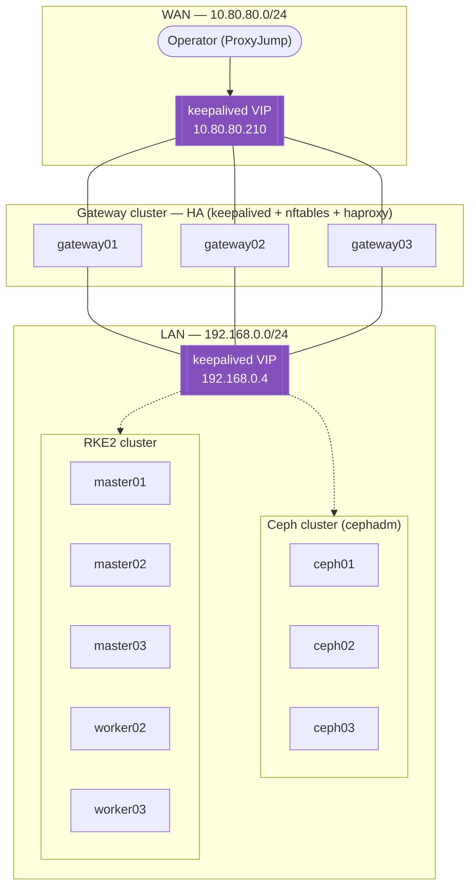

# Proxmox Homelab — Ceph + RKE2

A self-hosted Kubernetes lab, fully defined as code: **OpenTofu** provisions the VMs on **Proxmox VE**, **Ansible** turns them into a highly-available **RKE2** cluster backed by a **Ceph** storage cluster (via `cephadm`).


## Why this exists

A home lab to practice running production-shaped infrastructure end-to-end: infra-as-code provisioning, configuration management, an HA Kubernetes control plane, and a real distributed storage backend - instead of a single-node `k3s` with local-path storage.

## Architecture

Three physical Proxmox hosts (`node01`-`node03`) run every VM, spread across two networks: a WAN-facing network for management access, and a private LAN carrying all cluster traffic.



- **Gateways** are dual-homed (WAN + LAN) and run `nftables` (NAT/forwarding) + `keepalived` (VIP failover) + `haproxy` (L4 proxy to the RKE2 API/join ports and ingress), so they're the only way in from the outside and survive a single node failure.
- **Ceph** (3 nodes) and **RKE2** (3 masters + workers) live entirely on the private LAN, reached only through the gateway VIP.
- **RKE2** control-plane HA is handled by `haproxy` + `keepalived` on the gateways, proxying to all masters on 6443/9345; the first master bootstraps the cluster and hands out the join token to the rest.
- The end goal: Ceph as the **StorageClass backend** for RKE2 - RBD (`ceph-csi-rbd`) for `ReadWriteOnce`, CephFS (`ceph-csi-cephfs`) for `ReadWriteMany`.

## Repository layout

```
OpenTofu/
├── network/     # gateway VMs (dual-homed, keepalived VIP)
├── ceph/        # Ceph node VMs
└── rke2/        # RKE2 master/worker VMs

Ansible/
├── roles/
│   ├── init/               # baseline packages/config, shared by every host
│   ├── gateway/             # nftables + keepalived + haproxy
│   ├── ceph_init/           # cephadm bootstrap, OSDs, CephFS
│   ├── ceph_wait_healthy/   # poll until the cluster reports HEALTH_OK
│   └── rke2/                # RKE2 server/agent
├── scripts/gen_inventory.py # `tofu output -json` -> Ansible inventory
├── inventory/
│   ├── generated.ini        # hosts, derived from OpenTofu state (gitignored)
│   └── static/              # group vars OpenTofu doesn't know about
├── group_vars/
└── network.yml / ceph.yml / rke2.yml

install.sh   # tofu apply (x3) -> gen_inventory.py -> ansible-playbook (x3)
destroy.sh   # tears everything down in reverse order
```

**OpenTofu owns every IP address.** Each module's `variables.tf` is the single source of truth for its hosts; nothing is hardcoded in Ansible. `gen_inventory.py` reads `tofu output -json` and writes the Ansible inventory, so infrastructure and configuration management never drift apart. Anything OpenTofu *doesn't* know about (shared VIPs, SSH proxy settings, RKE2 version) lives in `inventory/static/` and `group_vars/`.

## Key design decisions

- **cephadm + Podman**, not native Debian/Ubuntu Ceph packages — Ubuntu Noble isn't packaged for the target Ceph release, and `cephadm` is the upstream-recommended path going forward anyway.
- **Ansible inventory is generated, not hand-maintained.** Re-running `tofu apply` never leaves stale hosts behind, and the repo never contains a real IP address that isn't already in a `.tf` file.
- **A dedicated `ceph_wait_healthy` role**, separate from `ceph_init` — `ceph orch apply` (OSDs, CephFS, MDS) returns immediately, before the orchestrator has actually converged. Anything that needs a healthy cluster polls for `HEALTH_OK` explicitly instead of hoping the timing works out.
- **HA everywhere it's cheap:** keepalived VIPs for both gateway and Ceph-facing LAN, `haproxy` on the gateways load-balancing the Kubernetes API/join ports across all masters — the lab tolerates losing any single Proxmox host.

## Prerequisites

- A Proxmox VE cluster (this lab targets 3 nodes) with a cloud-init-ready Ubuntu 24.04 image
- [OpenTofu](https://opentofu.org/) and an API token for the `bpg/proxmox` provider
- Ansible (`core >= 2.16`)

## Quickstart

```bash
cp env.sh.example env.sh
# fill in PROXMOX_VE_*, TF_VAR_ssh_keys, ...
source env.sh

./install.sh
```

`install.sh` runs, in order: `OpenTofu/network` → `OpenTofu/ceph` → `OpenTofu/rke2` → `gen_inventory.py` → the three Ansible playbooks. Everything is idempotent, so re-running it after a change is safe.

```bash
./destroy.sh   # tears down rke2 -> ceph -> network, in that order
```

## Status

- ✅ Gateway HA (keepalived + nftables + haproxy) provisioned and working
- ✅ Ceph cluster healthy: 3 mons in quorum, mgr active/standby, OSDs up, CephFS volume created
- ✅ RKE2 cluster up: HA control plane via `haproxy` + `keepalived` on the gateways, workers joined
- 🚧 Wiring Ceph into RKE2 as a storage backend:
  - [ ] RBD pool + `client.rbd-csi` keyring
  - [ ] CephFS `client.cephfs-csi` keyring
  - [ ] Kubernetes manifests (ConfigMap with monitors/fsid, keyring Secrets)
  - [ ] `ceph-csi` via Helm
  - [ ] `StorageClass` for RBD and CephFS

## License

Personal lab project, shared for reference — no license is granted for reuse.
